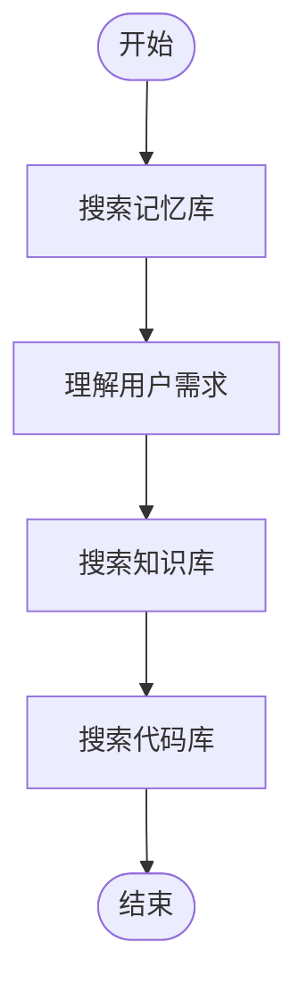

# 标准流水线

## 流程

## 节点

| 节点名称 | 执行内容 |
|----------|----------|
| 理解用户需求 | `.claude/nodes/理解用户需求.md` |
| 搜索知识库 | `.claude/nodes/搜索知识库.md` |
| 搜索记忆库 | `.claude/nodes/搜索记忆库.md` |
| 搜索代码库 | `.claude/nodes/搜索代码库.md` |

## 强制事项
- 强制创建一个`TodoList`列表来跟踪整个`流程`
- 强制严格按照`流程`执行 禁止跳过任何`流程`中的阶段
- `执行内容`中如果有文件路径代表这是该节点需要执行的任务 必须强制读取和完成
- 强制遵循`渐进式加载节点文件详情原则` 先查看并且理解`流程`整体内容 等你执行到某个节点之后才去查看`节点`中对应的具体内容`执行内容`
- 强制节点重试：如果执行某个节点没有达到预期那么尝试重试2次再进行下一个节点
## 禁止事项
- 禁止直接读取`执行内容`的文件
- 禁止编造/假设/伪造/杜撰/猜测/说谎一切信息
## 最佳实践
### 执行流程
- 1.查看WORKFLOW.md文件
- 2.理解`流程`整体内容 不查看节点具体文件
- 3.创建`TodoList`
- 4.按照`流程`中的节点执行
- 5.查看到`xxx`节点名称
- 6.通过`节点`中的节点名称映射到具体执行内容文件或者任务描述
- 7.读取并且节点的执行内容
- 8.如果执行成功更新`TodoList`任务状态 执行下一个节点 如果执行不成功执行重试
- 9.执行下一个节点 循环`读取节点`->`查看节点任务详情`->`执行节点`-`更新任务状态`执行到结束节点结束流程